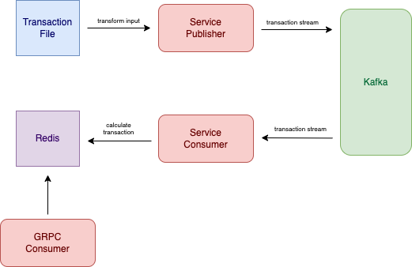

# ohlc



## Development 
### Setup development environment
- Run `docker compose up -d` or run `make up` to setup environment

### How to run
1. Import file from subsetdata directory, using command:
```
make publish
```
2. Run kafka consumer in other terminal with
```
make consume
```
3. Run rpc service in other terminal with
```
make run
```

## Directory structure

```
├── cmd
│   └── consumer
│       ├── main.go
│   └── publisher
│       ├── main.go
│   └── service
│       ├── main.go
├── kafka
│   └── consumer.go
│   └── publisher.go
├── proto
│   └── ohlc_grpc.pb.go
│   └── ohlc.pb.go
│   └── ohlc.proto
├── redis
│   └── redis.go
├── service
│   └── service_test.go
│   └── service.go
├── transaction
│   └── consume_test.go
│   └── consume.go
│   └── publish.go
├── util
│   └── ut.go
├── docker-compose.yml
├── Makefile
├── README.md
```

## Authors

- [@hutamy](https://www.github.com/hutamy)